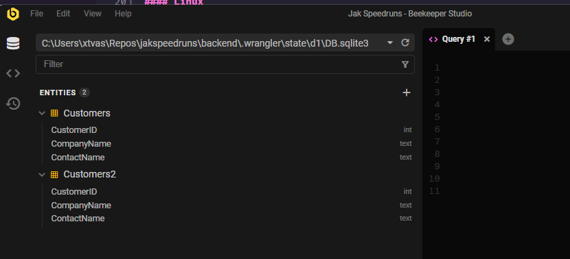

# Backend

## Developing Locally

### Requirements

- NodeJS >16.3
- yarn
- wrangler

#### Windows

Get a package manager, I'll use https://scoop.sh/

```bash
scoop install nodejs yarn
yarn global add wrangler
```

#### Linux

TODO

### Running

Install dependencies

```bash
yarn install
```

Initialize local SQLite Database (only has to be done once or when DB migrations change)

```bash
yarn setup-db
```

If you'd like to view the database, there are tons of tools to do so.  I'd recommend https://github.com/beekeeper-studio/beekeeper-studio/releases

The SQLite DB file will be located at `.wrangler/state/d1/DB.sqlite3`



To run the worker:

```bash
yarn start
```

Then hit a test endpoint to know it's functioning in your browser / Postman

http://127.0.0.1:8787/cron/speedrunUpdate (currently will fail)

http://127.0.0.1:8787/v1/runners (stubbed but successful)

## Components

Two Cloudflare workers
- 1 is a cron that will periodically poll from Speedrun.com's API to update the SQLite database
  - This means handling new runs, changed runs, and removed runs.
  - This cron could also be the location for firing off webhooks to the discord server when a new run is verified
- The other is an API that will pull information from this database, and the website / discord / etc can interact with.

Relevant Docs:
- https://developers.cloudflare.com/workers/
- https://developers.cloudflare.com/d1/
